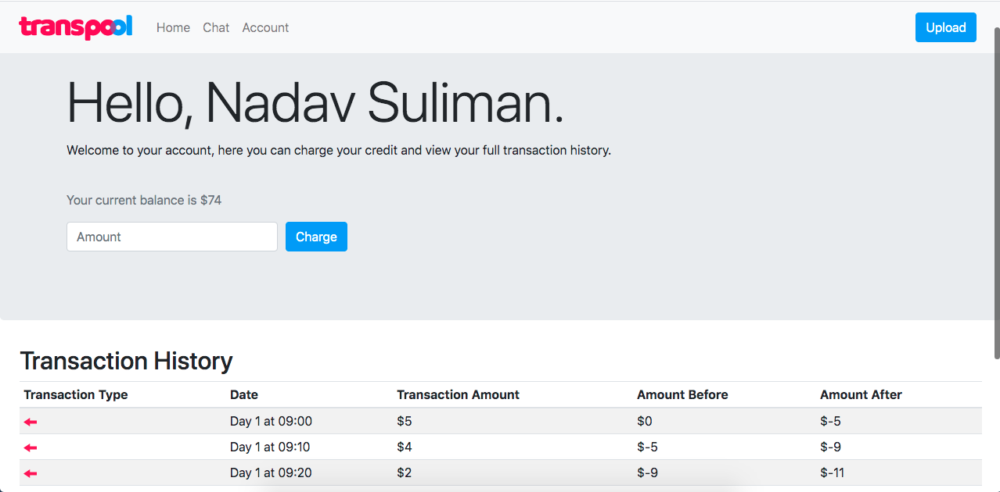
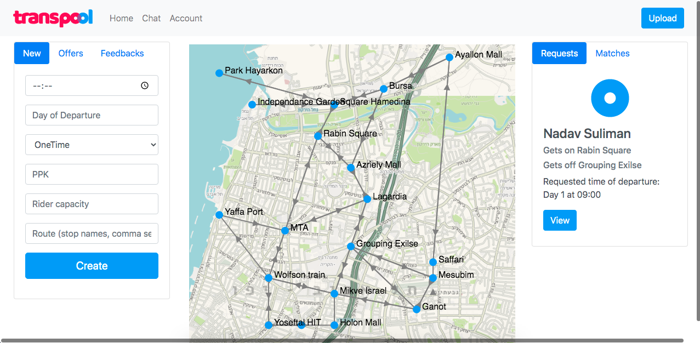
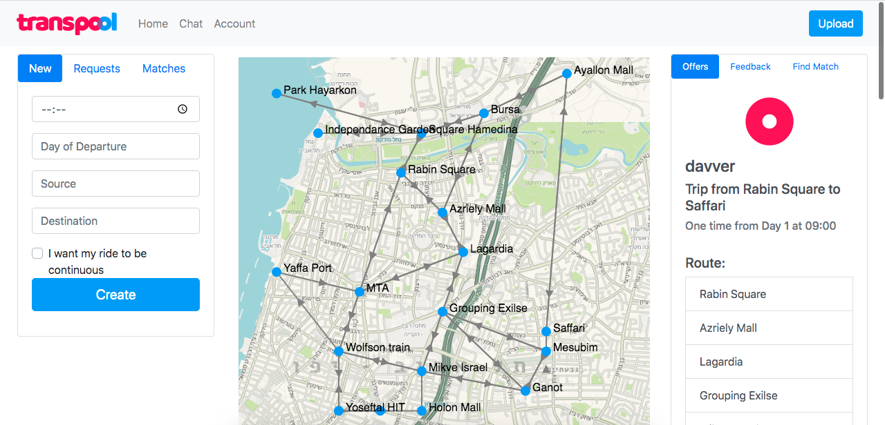
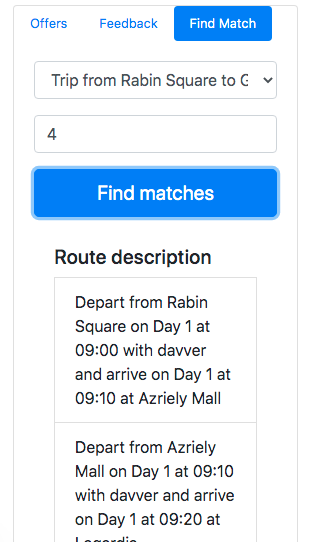

[TOC]

# Application Instructions

## Getting Started

After opening Tomcat, navigate to - localhost:8080/TransPool/ to open up the web application, and the landing page should open.

To go straight to the signup page - localhost:8080/TransPool/signup.html

Enter your username, choose your account type and you should be redirected to the TransPool homepage seen below

## The Homepage

Use the navbar on the top page to navigate through the website. You can start by uploading a map to the system by clicking the blue "Upload" button on the top right.

After uploading maps and doing some actions the page should look something like this:

### User Card

- A blue circle is the icon for a rider account and a red circle is the icon for a driver account
- Last three transactions and balance can be viewed under the username.
- A button to charge credit to your account is displayed on the bottom of this card, and it will take you to the account page of the user.
- To know more about transactions go to the transactions section in the readme file.

### Map Cards

- Map cards contain basic information about the uploaded map.
- You can open a map by clicking the Open button on the card, which will take you to page two.

## Account Page

The account page displays the balance information and all transactions made for the user throughout the system's life.

- You can charge your account with credit by entering an amount and then clicking the 'Charge' button.
- Transaction types are marked with icons
  - Red arrow for **payment**
  - Green arrow for **recieving money**
  - Blue plus sign for **charge**

## Map Page

When clicking 'Open' on a map in the homepage, you will see the map page. This page is different for each user type as each user can do different actions.

### For Drivers

The left side bar shows information about the user's offers, and the user's feedbacks from all the maps. The right side bar shows requests and matches on this map.

**IMPORTANT: To create a new trip offer - the route must be entered as stop names, comma seperated without spaces between the commas!**

### For Riders

The left side-bar shows all information about the current user, while the right side-bar shows all information about the current map (regardless of the user).

#### Left side-bar

In the left side bar, the user can view his ride requests, his upcoming matches, or create a new trip request for the map.

#### Right side-bar

On the right side bar, the user can view the trip offers on this current map. In addition to that, the user can find a match for a request he has made on this map, or feedback a driver he had ridden with in the past.

##### Finding a match

To find a match, you must choose the request you want to match, choose the amount of matches you want to see and if there are any matches found, then a list of ride descriptions will be shown below. Each ride description has a button 'Match' which will allow you to join the ride.

Once you join a ride, the driver will be notified.

##### Feedbacking

To feedback a user, you must choose the relvant user you want to feedback, add a comment (optional) and rating, and click 'Feedback'. The user will receive a notification about your feedback.
